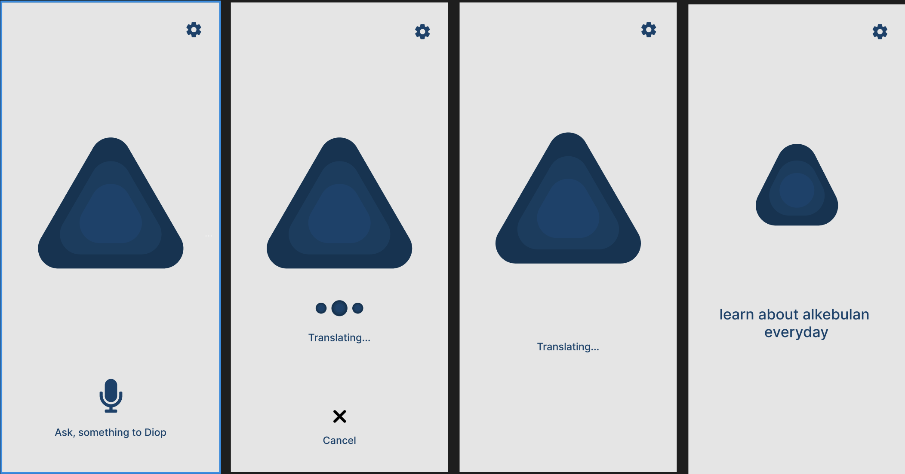

# Diop: Your Humorous African Virtual Assistant 🧑🏿‍💻

Diop is a unique virtual assistant that responds with an African accent and a touch of humor, making interactions fun and authentic! Built with the best practices in iOS app development, Diop leverages modern Apple technologies to deliver an immersive and engaging experience.

 <!-- Replace with the correct path to your image -->

## 🛠️ Technologies Used
Diop was developed with Apple’s latest technologies and a robust software architecture. The key technologies include:

- **SwiftUI**: For creating dynamic and attractive user interfaces.
- **SwiftData**: For efficient data management and local storage.
- **MVVM**: Architecture for a clear separation between UI and business logic.
- **CoreML**: For integrating machine learning and generating intelligent responses.
- **Combine**: For managing reactive subscriptions and data flows seamlessly.

## 🎯 Objective
Diop aims to be more than a typical virtual assistant. With an authentic African accent and humor that reflects rich African culture, Diop delivers unique and relaxed responses, perfect for casual conversations or simple questions!

## 🌟 Features
- Spoken responses with an African accent
- Engaging humor in every interaction
- CoreML integration for smart responses
- Intuitive design with SwiftUI and real-time data updates with Combine

## 🚀 How to Run the Project
1. Clone the repository:
   ```bash
   git clone https://github.com/your-username/Diop.git
Open the project in Xcode.
Connect an iOS device or use the simulator to start.
Build and run the project.

👤 Author
Josemar Silva

Connect with me on LinkedIn to explore more interesting projects!
[]([https://www.linkedin.com/](https://www.linkedin.com/in/josemar-silva-550b38124/))
